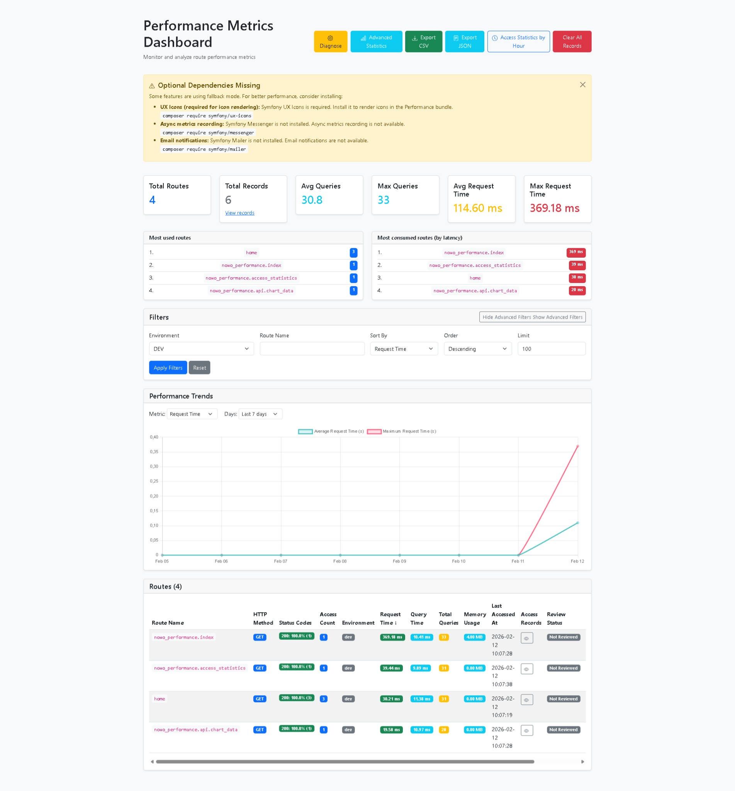
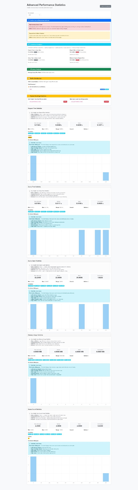
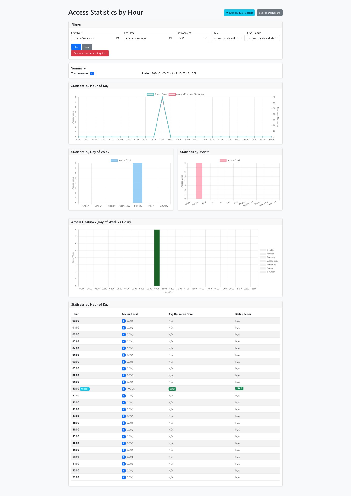

# Performance Bundle

[](https://github.com/nowo-tech/PerformanceBundle/actions/workflows/ci.yml) [](https://packagist.org/packages/nowo-tech/performance-bundle)  [](https://packagist.org/packages/nowo-tech/performance-bundle) [](https://packagist.org/packages/nowo-tech/performance-bundle) [](https://php.net) [](https://symfony.com)

> ⭐ **Found this project useful?** Give it a star on GitHub! It helps us maintain and improve the project.

**Symfony bundle for tracking and analyzing route performance metrics.** Automatically records request time, database query count, and query execution time for performance analysis.

> 📋 **Compatible with Symfony 6.1+, 7.x, and 8.x** - This bundle requires Symfony 6.1 or higher.

## What is this?

This bundle helps you **track and analyze route performance** in your Symfony applications:

- 📊 **Automatic Performance Tracking** - Automatically tracks route performance metrics
- 🔍 **Query Analysis** - Counts and times database queries per route
- ⏱️ **Request Timing** - Measures request execution time
- 📈 **Performance Analysis** - Identifies slow routes and query-heavy endpoints
- 🎯 **Route Metrics** - Stores metrics per route and environment
- 🔧 **Manual Updates** - Command to manually set/update route metrics

## Quick Search Terms

Looking for: **route performance**, **performance monitoring**, **query tracking**, **Symfony performance**, **route metrics**, **performance analysis**, **database query tracking**, **request timing**, **profiling**, **performance bundle**? You've found the right bundle!

## Features

- ✅ Automatic route performance tracking via event subscribers
- ✅ Database query counting and execution time tracking
- ✅ Request execution time measurement
- ✅ **Memory usage tracking** - Track peak memory consumption per route
- ✅ **Access frequency tracking** - Track how often routes are accessed
- ✅ **HTTP status code tracking** - Track and calculate ratios for HTTP status codes (200, 404, 500, etc.)
- ✅ **Sub-request tracking** - Optional tracking of sub-requests (ESI, fragments, includes) in addition to main requests
- ✅ **Performance notifications** - Email, Slack, Teams, and webhook notifications for performance alerts
- ✅ Route data persistence in database
- ✅ Environment-specific metrics (dev, test, prod)
- ✅ Configurable route ignore list
- ✅ Command to manually set/update route metrics
- ✅ Support for multiple Doctrine connections
- ✅ Performance dashboard with filtering and sorting
- ✅ **Data export** - CSV and JSON export functionality
- ✅ **Record management** - Delete individual records (optional)
- ✅ **Review system** - Mark and edit records as reviewed with improvement tracking (optional)
- ✅ **Bootstrap and Tailwind CSS support** - Choose your preferred CSS framework
- ✅ Role-based access control for dashboard
- ✅ WebProfiler integration with ranking information
- ✅ **Chart.js integration** - Interactive performance charts
- ✅ **Symfony UX Twig Components** - Optional modern component system
- ✅ Symfony 6.1+, 7.x, and 8.x compatible

## Screenshots

The bundle provides a web dashboard to monitor and analyze route performance. Below are the main views.

### Performance Metrics Dashboard

The main dashboard shows KPIs (total routes, records, average/max queries and request time), top routes by usage and by latency, filters (environment, sort, limit), an optional “Optional Dependencies Missing” alert with `composer require` hints, a **Performance Trends** chart (average and max request time over days), and a **Routes** table with columns: route name, HTTP method, status codes, access count, environment, request time, query time, total queries, memory usage, last accessed at, access records link, and review status.



*Access: dashboard path configured in `nowo_performance.dashboard.path` (e.g. `/performance`). Use **Diagnose**, **Advanced Statistics**, **Export CSV/JSON**, **Access Statistics by Hour**, and **Clear All Records** from the toolbar.*

### Advanced Performance Statistics

This view provides statistical analysis to find optimization targets: **Performance Recommendations** (e.g. high average query count, request time outliers), **Correlation Analysis** (request time vs query time, query time vs query count, memory vs request time), **Efficiency Analysis** (query time ratio), **Traffic Distribution** and hot/bad routes, **Routes Needing Attention** (high request time or query count by percentile), and detailed **Request Time**, **Query Time**, **Query Count**, **Memory Usage**, and **Access Count** sections with min/mean/median/max, percentiles, and distribution histograms.



*Access: **Advanced Statistics** button from the main dashboard. Requires enough route data for meaningful stats.*

### Access Statistics by Hour

When **temporal access records** are enabled (`enable_access_records: true`), this page shows access patterns over time: filters (date range, environment, route, status code), **Total Accesses** and period, **Statistics by Hour of Day** (line chart: access count and average response time), **Statistics by Day of Week** and **by Month** (bar charts), **Access Heatmap** (day of week vs hour), and a detailed table by hour with access count, average response time, and status code breakdown. You can **Delete records matching filter** from here.



*Access: **Access Statistics by Hour** from the main dashboard. Requires `enable_access_records: true` and the `routes_data_records` table (see [Configuration](docs/CONFIGURATION.md#enable_access_records)).*

## Installation

```bash
composer require nowo-tech/performance-bundle
```

[](https://packagist.org/packages/nowo-tech/performance-bundle)

Then, register the bundle in your `config/bundles.php`:

```php
<?php

return [
    // ...
    Nowo\PerformanceBundle\NowoPerformanceBundle::class => ['all' => true],
];
```

## Quick Start

1. **Configure the bundle** (optional - works with defaults):

```yaml
# config/packages/nowo_performance.yaml
nowo_performance:
    enabled: true
    environments: ['prod', 'dev', 'test']
    connection: 'default'
    track_queries: true
    track_request_time: true
    ignore_routes:
        - '_wdt'
        - '_profiler'
        - 'web_profiler*'
        - '_error'
        dashboard:
            enabled: true
            path: '/performance'
            template: 'bootstrap'  # or 'tailwind'
            roles: ['ROLE_ADMIN']  # Optional: restrict access
```

2. **Create the database table(s)**:

   **Option A: Using the bundle commands (Recommended)**:
   ```bash
   php bin/console nowo:performance:create-table
   # If you use temporal access records (enable_access_records: true):
   php bin/console nowo:performance:create-records-table
   # Or sync both tables in one go (add/alter columns from entities):
   php bin/console nowo:performance:sync-schema
   ```

   **Option B: Using Doctrine Schema**:
   ```bash
   php bin/console doctrine:schema:update --force
   # or
   php bin/console doctrine:migrations:diff
   php bin/console doctrine:migrations:migrate
   ```

3. **That's it!** The bundle will automatically track route performance metrics in the configured environments.

For detailed installation steps (including sync-schema and migrations), see [Installation Guide](docs/INSTALLATION.md).

## Usage

### Automatic Tracking

The bundle automatically tracks performance metrics for all routes (except ignored ones) in configured environments.

### Manual Metrics Update

Use the command to manually set or update route metrics:

```bash
# Set route metrics
php bin/console nowo:performance:set-route app_home \
    --env=dev \
    --request-time=0.5 \
    --queries=10 \
    --query-time=0.2

# Update with worse metrics (higher time or more queries)
php bin/console nowo:performance:set-route app_user_show \
    --env=prod \
    --request-time=1.2 \
    --queries=25 \
    --query-time=0.3 \
    --params='{"id":123}'
```

### Accessing Metrics

```php
use Nowo\PerformanceBundle\Service\PerformanceMetricsService;

// Get route data
$routeData = $metricsService->getRouteData('app_home', 'dev');

// Get all routes for environment
$routes = $metricsService->getRoutesByEnvironment('dev');

// Get worst performing routes
$worstRoutes = $metricsService->getWorstPerformingRoutes('dev', 10);
```

## Requirements

- PHP >= 8.1, < 8.6
- Symfony 6.1+, 7.x, or 8.x
- Doctrine ORM ^2.13 || ^3.0
- Doctrine Bundle ^2.8 || ^3.0 (3.0 required for Symfony 8)

## Configuration

The bundle works with default settings. Create `config/packages/nowo_performance.yaml`. For the full reference and all options, see [Configuration Guide](docs/CONFIGURATION.md).

```yaml
nowo_performance:
    enabled: true
    environments: ['prod', 'dev', 'test']
    connection: 'default'
    table_name: 'routes_data'
    track_queries: true
    track_request_time: true
    track_sub_requests: false
    ignore_routes:
        - '_wdt'
        - '_profiler'
        - 'web_profiler*'
        - '_error'
    dashboard:
        enabled: true
        path: '/performance'
        template: 'bootstrap'  # or 'tailwind'
        roles: []  # empty = unrestricted
```

## Commands

See [Commands](docs/COMMANDS.md) for full documentation. Main commands:

- **`nowo:performance:create-table`** - Create or update the main metrics table (`routes_data`)
- **`nowo:performance:create-records-table`** - Create or update the access records table (`routes_data_records`); use when `enable_access_records: true`
- **`nowo:performance:sync-schema`** - Sync both tables with entity metadata (add/alter columns)
- **`nowo:performance:set-route`** - Set or update route performance metrics manually
- **`nowo:performance:diagnose`** - Diagnostic report of bundle configuration, tables, and tracking status
- **`nowo:performance:check-dependencies`** - Check status of optional dependencies (UX Icons, Messenger, Mailer)
- **`nowo:performance:purge-records`** - Purge old access records (by age or all)
- **`nowo:performance:rebuild-aggregates`** - Rebuild `RouteData` aggregates from access records

## Entity Structure

The `RouteData` entity stores:

- `id` - Primary key
- `env` - Environment (dev, test, prod)
- `name` - Route name
- `totalQueries` - Total number of database queries
- `queryTime` - Total query execution time in seconds
- `requestTime` - Request execution time in seconds
- `memoryUsage` - Peak memory usage in bytes (nullable)
- `accessCount` - Number of times route was accessed (default: 1)
- `lastAccessedAt` - Last access timestamp (nullable)
- `httpMethod` - HTTP method (GET, POST, PUT, DELETE, etc.) (nullable)
- `statusCodes` - HTTP status codes counts (JSON, e.g., {'200': 100, '404': 5}) (nullable)
- `reviewed` - Whether record has been reviewed (default: false)
- `reviewedAt` - Review timestamp (nullable)
- `queriesImproved` - Whether queries improved after review (nullable)
- `timeImproved` - Whether time improved after review (nullable)
- `reviewedBy` - Username of reviewer (nullable)
- `params` - Route parameters (JSON)
- `createdAt` - Creation timestamp
- `updatedAt` - Last update timestamp

## How It Works

1. **Event Subscriber** (`PerformanceMetricsSubscriber`) listens to kernel events
2. On `KernelEvents::REQUEST`, it starts tracking:
   - Request start time
   - Resets query tracking middleware
3. On `KernelEvents::TERMINATE`, it:
   - Calculates request time
   - Collects query count and execution time using multiple strategies:
     - **Primary**: `QueryTrackingMiddleware` (DBAL middleware for DBAL 3.x compatibility)
     - **Fallback 1**: `DoctrineDataCollector` from Symfony profiler
     - **Fallback 2**: Request attributes (`_profiler`, `_profiler_profile`)
     - **Fallback 3**: Stopwatch (time only)
   - Saves metrics to database via `PerformanceMetricsService`
4. Metrics are only updated if they're worse (higher time or more queries)

### Query Tracking Architecture

The bundle uses a **multi-layered approach** for query tracking:

- **QueryTrackingMiddleware**: A custom DBAL middleware that intercepts all database queries at the driver level. This is the primary method and works with DBAL 3.x (which removed `SQLLogger`).
- **DoctrineDataCollector**: Falls back to Symfony's built-in profiler data collector if the middleware is not available.
- **Request Attributes**: Attempts to access profiler data from request attributes for sub-requests.
- **Stopwatch**: Last resort fallback for timing information only (does not provide query count).

This ensures reliable query tracking across different Symfony and Doctrine versions.

## Documentation

- [**Documentation index**](docs/README.md) – Index of all documentation with cross-references
- [Installation Guide](docs/INSTALLATION.md) – Step-by-step installation (tables, sync-schema, verify)
- [Configuration Guide](docs/CONFIGURATION.md) – All options and defaults (source of truth)
- [Usage Guide](docs/USAGE.md) – Automatic tracking, manual commands, dashboard customization, events
- [Commands](docs/COMMANDS.md) – All `nowo:performance:*` commands (create-table, create-records-table, sync-schema, diagnose, purge-records, etc.)
- [Events & priorities](docs/EVENTS.md) – Custom events and listener flow (relevant for `ignore_routes`)
- [Compatibility Guide](docs/COMPATIBILITY.md) – Doctrine and DBAL version compatibility
- [Notifications](docs/NOTIFICATIONS.md) – Performance alert notifications (Email, Slack, Teams, Webhooks)
- [CHANGELOG](docs/CHANGELOG.md) – Version history
- [UPGRADING](docs/UPGRADING.md) – Upgrade instructions
- [ROADMAP](docs/ROADMAP.md) – Future improvements and features

## Testing

```bash
# Run tests
composer test

# Run with coverage
composer test-coverage
```

## License

The MIT License (MIT). Please see [LICENSE](LICENSE) for more information.

## Contributing

We welcome contributions! Please see [CONTRIBUTING.md](docs/CONTRIBUTING.md) for details.

## Author

Created by [Héctor Franco Aceituno](https://github.com/HecFranco) at [Nowo.tech](https://nowo.tech)
